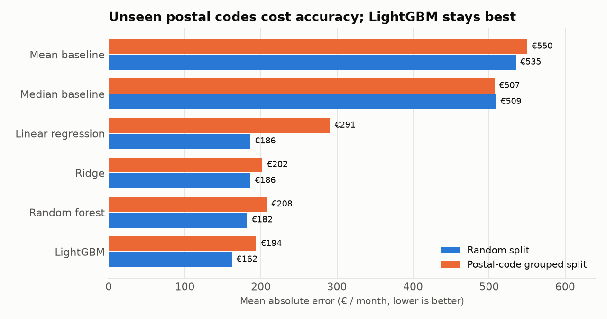
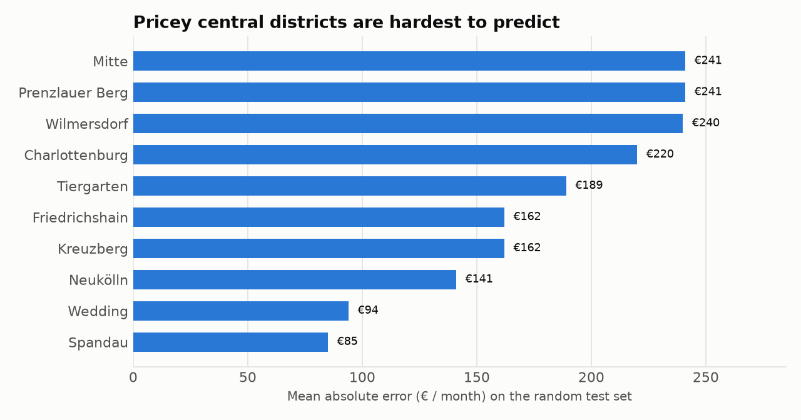

<div align="center">

# BerlinRentML

**Predict Berlin apartment rents. Validated on postal codes the model has never seen.**

[Quick start](#quick-start) · [Results](#results) · [Limitations](#limitations) · [Model card](MODEL_CARD.md)


</div>

Enter a flat, get a rent estimate. Trained on about 10,000 real ImmoScout24 Berlin listings and served through a Streamlit UI and a FastAPI endpoint, with tests, Docker and CI.

Berlin listings cluster by location, so a random train/test split leaks neighbourhood information and flatters the score. This project also evaluates with a **postal-code grouped split**, where every test postal code is unseen during training.

## Quick start

```bash
pip install -e ".[dev]"
python scripts/train.py            # trains, compares models, saves models/
python scripts/analyze_errors.py   # error by district, size and price range
python scripts/explain_model.py    # SHAP feature importance
pytest                             # run tests
streamlit run app/streamlit_app.py # web UI at http://localhost:8501
```

Or serve the REST API instead of the UI:

```bash
uvicorn berlinrentml.api.main:app --port 8000
```

```bash
curl -X POST localhost:8000/predict -H "Content-Type: application/json" \
  -d '{"livingSpace": 60, "rooms": 2, "geo_plz": "10115", "geo_bln": "Mitte"}'
```

```json
{"predicted_rent": 1142.54, "model_name": "LGBMRegressor", "timestamp": "..."}
```

Same flat in Marzahn (`"geo_plz": "12619", "geo_bln": "Marzahn"`) returns about 613 €. Interactive docs are at `/docs`.

## Results

10,388 Berlin listings after cleaning, 80/20 split. LightGBM wins on both splits.



- **LightGBM:** R² 0.880 on the random split, 0.836 on unseen postal codes. About 62% lower error than the median baseline.
- **Leakage is real:** linear regression goes from €186 to €291 once test postal codes are unseen. The final model is picked by grouped-split MAE, not random-split MAE.
- **Where it fails:** the model is least accurate in expensive central districts and for large flats, which it under-prices.



## What is inside

| Area | What it does |
|---|---|
| Data | Loads the Kaggle CSV, filters to Berlin, maps columns, validates schema and ranges |
| Cleaning | Removes impossible values, caps rent outliers, handles missing data |
| Features | Building age, size and age bins, log size, rooms per m², amenity score |
| Evaluation | Random split and `GroupedSplit` by postal code, MAE, RMSE, R², share within €50/100/200 |
| Models | Mean, median, linear, ridge, random forest, LightGBM, XGBoost, lasso, elastic net |
| Serving | FastAPI with validated requests, `/health`, `/model/info`, `/predict` |
| Quality | pytest suite, GitHub Actions CI, Dockerfile, model card |

## Install

Requires Python 3.10 or newer.

```bash
git clone https://github.com/arjun05-tf/berlin-rent-predictor.git
cd berlin-rent-predictor
pip install -e ".[dev]"
```

### Get the data

Download `immo_data.csv` from [Kaggle: Apartment rental offers in Germany](https://www.kaggle.com/datasets/corrieaar/apartment-rental-offers-in-germany) and place it in `data/raw/`. Or use the CLI:

```bash
kaggle datasets download -d corrieaar/apartment-rental-offers-in-germany -p data/raw --unzip
```

The dataset has 268,850 listings across Germany from 2018 to 2020. The pipeline keeps the 10,406 Berlin rows. The CSV is gitignored. See [data/DATASET.md](data/DATASET.md).

## Common commands

```bash
python scripts/train.py            # full pipeline, saves models/final_model_*.joblib
python scripts/analyze_errors.py   # error by district, size and price range
python scripts/explain_model.py    # SHAP feature importance
pytest                             # run tests
```

### Docker

Train first, because the image copies `models/`.

```bash
docker build -t berlin-rent .
docker run -p 8000:8000 berlin-rent
```

## Project layout

```
src/berlinrentml/
  data/        loading, validation, cleaning
  features/    feature engineering, preprocessing
  modeling/    training, evaluation, split strategies
  api/         FastAPI service
scripts/       train, error analysis, SHAP
tests/         unit and API tests
```

## Limitations

- The data is from 2018 to 2020. Predictions reflect past rents, not today's market.
- Offered rents are asking prices, not signed contracts.
- Postal codes unseen in training fall back on the other features, and accuracy drops (about €31 MAE worse than the random split).
- The final model uses default LightGBM parameters. Tuning is future work.

See [MODEL_CARD.md](MODEL_CARD.md) for intended use and ethical considerations.

## Troubleshooting

| Problem | Fix |
|---|---|
| `Model not loaded` from `/predict` | Run `python scripts/train.py` first |
| `No data file found` | Put `immo_data.csv` in `data/raw/` |
| `UnicodeEncodeError` on Windows | Set `PYTHONUTF8=1` before running scripts |
| Docker build fails at `COPY models/` | Train first so `models/` has the `.joblib` files |

## License

MIT. Data from ImmoScout24 via Kaggle, see the dataset page for its terms.
